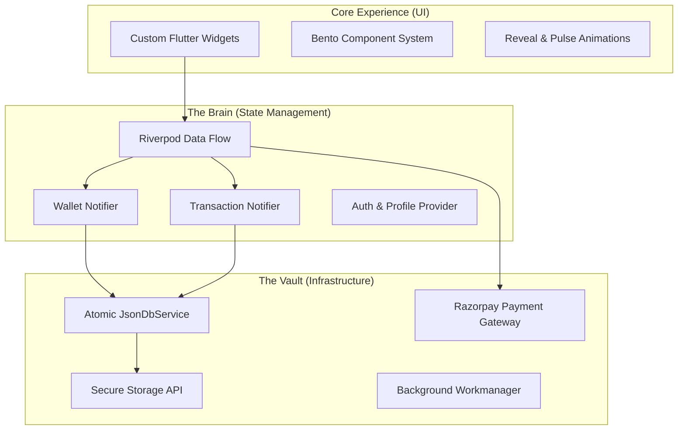
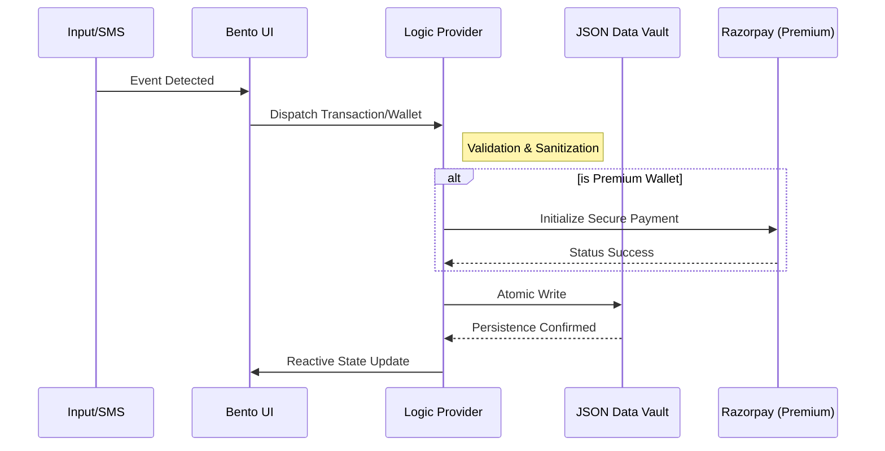

# 🌿 Minty: The Architecture of Financial Zen

**Premium. Mindful. Uncompromising.**

Minty is not just an expense tracker; it is a **financial consciousness platform**. Designed for those who demand clarity without the clutter, Minty combines a monochromatic "Mint" aesthetic with high-performance engineering to transform personal finance into a state of flow.

---

## 📈 The Impact: Beyond Tracking
Most apps tell you *what* you spent. Minty helps you understand *why*. Our design philosophy centers on **Financial Mindfulness**:
- **Clarity of Intent**: Through the "Bento UI" system, information is curated to reduce cognitive load.
- **Immediate Awareness**: 24-hour granular insights help you catch spending patterns before they become habits.
- **Tactile Control**: Haptic-driven interactions ensure every transaction feels significant, reinforcing financial discipline.

---

## ✨ Core Pillars of Excellence

### 🍱 The Bento UI System
Inspired by modular Japanese design, our Bento-style dashboard organizes your financial life into clean, interactive blocks.
- **Integrated Insights**: Real-time summaries of "This Week" and "This Month" net positions.
- **Spatial Discovery**: Elastic search and filter components for instant transaction retrieval.

### 💰 Monetized Multi-Wallet Architecture
A robust system designed for power users who manage multiple facets of their life.
- **Free Baseline**: Dedicated accounts for *Personal* and *Savings* out of the box.
- **Premium Expansion**: Secure **Razorpay Integration** allows users to unlock "Super Wallets" for specialized budgeting.
- **Global Reconciliation**: A base-currency engine that aggregates total wealth across all wallets instantly.

### 📊 Precision Engineering
- **24-Hour Micro-Insights**: A fixed timeline chart that centers on the "Now," providing immediate temporal context.
- **Haptic Feedback Engine**: Heavy, medium, and light haptic layers integrated into the transaction lifecycle.
- **SMS Intelligence**: Automated parsing of bank alerts for zero-effort entry (Optional/Permission-based).

---

## 🏛️ System Architecture

Minty is built on a **Layered Feature-Driven Architecture**, ensuring that the UI remains reactive, the logic remains testable, and the data remains secure.

---

## 🔄 The Transaction Lifecycle

Precision at every step, from detection to persistence.

---

## 🛠️ Technical Sophistication

### Tech Stack
- **Framework**: Flutter (Advanced Canvas & Custom Painter)
- **State**: Riverpod (Reactive Architecture)
- **Database**: Hive NoSQL & Atomic JSON Services
- **Payments**: Razorpay SDK
- **Automation**: Workmanager (Isolate-based background tasks)
- **Typography**: Dual-font system combining **Playfair Display** (Elegance) and **Inter** (Data Precision).

### Development setup
1. **Clone the repository**
2. **Install Dependencies**: `flutter pub get`
3. **Environment**: Ensure a valid `Razorpay Key ID` is set in `PaymentService`.
4. **Build**: `flutter run --release`

---

## 🎨 Design Philosophy: "Mint"
Minty adheres to the **Mint Monochromatic System**:
- **Dark Mode Optimization**: Deep-green shades reduce eye-strain and optimize battery life.
- **50px Curvature**: 50px border radii on bottom sheets for an organic, premium feel.
- **Zero-Placeholder Policy**: Every icon and asset is curated for meaning, not filler.

---

**Minty** — *Architecture for the Mindful.*
